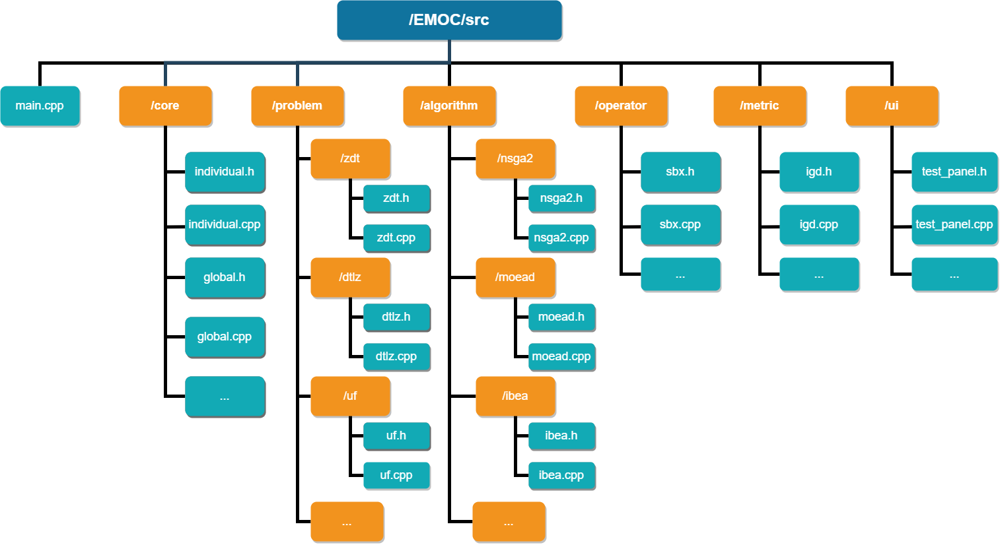
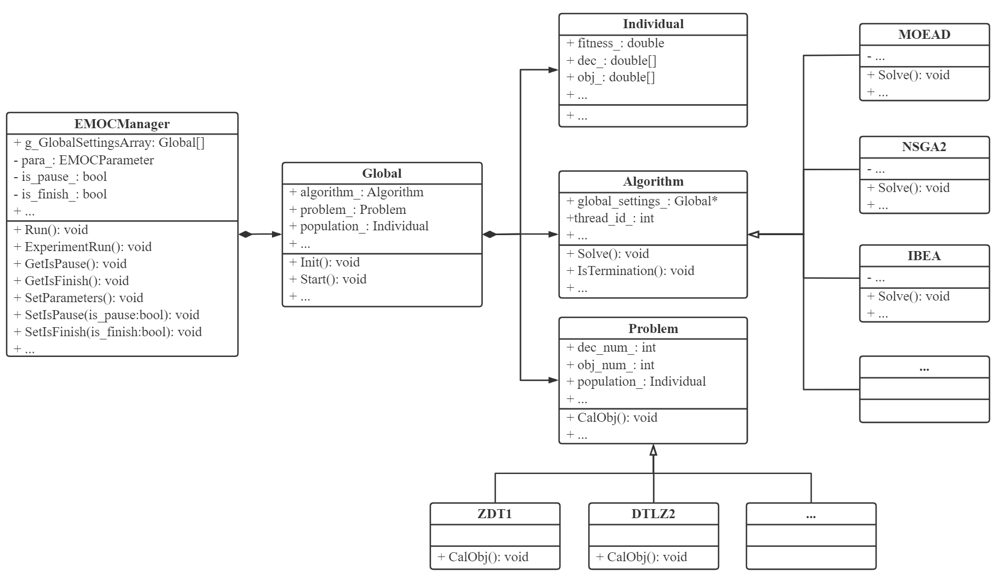

# Architecture of EMOC

Before we dive into the details and functions of some core classes, let's take a look at the architecture of EMOC.

## File Structure

After going into the source code directory **'/EMOC/src'**, users can see a lot of .h and .cpp files organized in a structure shown below.

There are one **'main.cpp'** file and six folders in the **'/src'** directory of EMOC. It is very easy to find the implementation details of specified algorithms, problems, operators and metrics in each folders. The **'main.cpp'** file is the entry point of EMOC. The first folder **'/core'** contains  some basic classes and important functions. The second folder **'/problem'** has a lot of subfolder for different test problems. For example, the subfolder **'/uf'** contains 10 UF problems (i.e., UF1~10). The next folder **'/algorithm'** is used to store all the algorithms in EMOC, where each algorithm has an independent subfolder. All the relevant functions are member functions of the specified algorithm class.  The **'/operator'** and **'/metric'** folder store the functions of all the operators and performance indicators, respectively.  The last folder **'/ui'** stores the classes of interactive GUI of EMOC.

## Class Diagram

EMOC also has a simple architecture where it involves some core classes structured as below.

The leftmost class `EMOCManager` is the manager class of EMOC which controls the command mode and GUI mode. It contains some basic state variables of EMOC such as pause or not in GUI mode. `EMOCManager` class also has an array of `Global` class.  A `Global` object is an execution entity of EMOC which basically is a specified algorithm optimized a certain problem with pre-defined parameters. All the relevant datas are stored in it. The following class is `Individual` that represents a solution of population. The last two classes `Algorithm` and `Problem` are parent classes of all the algorithms and problems respectively. They provide some useful interfaces and declared a few virtual functions that need to implemented by their subclasses.

All the details of these core classes will be introduced in the following sections.