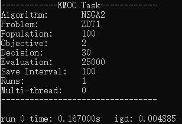

# Command Line Mode

Except using EMOC in the GUI mode, we also provide command line (CMD) mode for these users who don't have a display screen for some reasons(like on a remote server).

## A Simple Case

Go to the directory of executable file and open the terminal. Users can run EMOC with default parameters by just:

```bash
./EMOC
```

For windows, change the **'./EMOC'** to **'EMOC.exe'**. Some settings and results information  will be printed in the terminal:



(**Note:** If you want to calculate the indicator values of optimization results, the executable file should in the same directory with **'/pf_data'**.)

After executing, the optimized population results will be saved in **/output/test_module/** directory.


## Run EMOC with Different Parameters

In CMD mode, users can also set different parameters of this run, an example is shown below:

```bash
./EMOC --algorithm MOEADDE --problem DTLZ1 --evaluation 25000 -N 100
```

this command sets the algorithm to MOEADDE, the problem to DTLZ1, the max evaluation to 25000 and the population number to 100. All acceptable parameters are listed in the following table:

| Parameter Name     | Description                                        | Default Value |
| ------------------ | -------------------------------------------------- | ------------- |
| `-h, --help`       | Print some helpful information in the terminal     | None          |
| `-g, --gui`        | Run EMOC in GUI mode                               | False         |
| `-a, --algorithm`  | Algorithm name                                     | NSGA2         |
| `-p, --problem`    | Problem name                                       | ZDT1          |
| `-N, --pop`        | Population size                                    | 100           |
| `-m, --obj`        | Problem's objective dimension                      | 2             |
| `-n, --dec`        | Problem's decision variable dimension              | 30            |
| `-e, --evaluation` | Max evaluation number for each run                 | 25000         |
| `-i, --interval`   | Population save interval in generation             | 100           |
| `-r, --run`        | The number of runs                                 | 1             |
| `--multithread`    | Whether to use multi-thread                        | False         |
| `-t, --thread`     | Thread number (only valid when using multi-thread) | 4             |


## Available Algorithms and Problems

The available algorithms and problems in EMOC are listed below.

**Algorithms：**

| Decomposition Based | Dominance Based | Indicator Based | Constraint | Single Objective      |
| ------------------- | --------------- | --------------- | ---------- | --------------------- |
| MOEAD               | NSGA2           | IBEA            | CNSGA2     | GA                    |
| MOEADDE             | NSGA3           | HypE            | CMOEAD     | DifferentialEvolution |
| MOEADDRA            | SPEA2           | SMSEMOA         | CTAEA      | SA                    |
| MOEADGRA            | SPEA2SDE        |                 |            |                       |
| MOEADIRA            | tDEA            |                 |            |                       |
| ENSMOEAD            |                 |                 |            |                       |
| MOEADCDE            |                 |                 |            |                       |
| MOEADSTM            |                 |                 |            |                       |
| MOEADPAS            |                 |                 |            |                       |
| MOEADM2M            |                 |                 |            |                       |
| MOEADD              |                 |                 |            |                       |
| MOEADDYTS           |                 |                 |            |                       |
| MOEADFRRMAB         |                 |                 |            |                       |
| MOEADUCB            |                 |                 |            |                       |
| RVEA                |                 |                 |            |                       |

**Problems:**

| Single Objective | Multi Objective   | Many Objective   | Constraint    |
| ---------------- | ----------------- | ---------------- | ------------- |
| Sphere           | ZDT Series        | DTLZ Series      | CDTLZ Series  |
| Ackley           | UF Series         | MinusDTLZ Series | DCDTLZ Series |
| Rastrigin        | BT Series         | MDTLZ Series     |               |
| TSP              | MOEADDE_F Series  | WFG Series       |               |
| Knapsack         | IMMOEA_F Series   | LSMOP Series     |               |
|                  | MOEADM2M_F Series |                  |               |