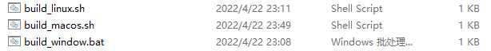

# Use EMOC in Python

To increase the flexibility of EMOC, we also provide a method to compile the source code to a python dynamic link library (DLL). So that EMOC can be used in python language too.


## Build

EMOC project provides script files on different platforms for the ease of building. 



Open your platform's script file with a text editor and find the row begin with `cmake -DBUILD_PYTHON_DLL=OFF`. Change the `OFF` to `ON`. For example:

```bash
# build_linux.sh

# download dependencies
sudo apt install gnuplot gnuplot-x11
sudo apt install xorg-dev
sudo apt install mesa-common-dev libgl1-mesa-dev

# build EMOC
mkdir build
cd build
cmake -DBUILD_PYTHON_DLL=ON ..
make -j4
```

The following build steps are the same as we talked in [Install section](), just execute the script file directly. After building successfully, the DLL file **'EMOC.xxxx.so'** (or **'EMOC.xxxx.pyd'** on windows) will appear in **'/build'** directory. Rename it to **'EMOC.so'** (or **'EMOC.pyd'**) and put it with your python file.


## Custom Problem

Users can define their own problems in python like this:

```python
import EMOC
import numpy as np

class MyUF1(EMOC.Problem):
    def __init__(self, dec_num, obj_num):
        super(MyUF1, self).__init__(dec_num,obj_num)
        lower_bound = [-1] * dec_num
        lower_bound[0] = 0
        self.lower_bound = lower_bound
        self.upper_bound = [1] * dec_num

    def CalObj(self, ind):
        x = ind.dec
        temp_obj = [0] * self.obj_num
        # print("here\n")
        sum1 = 0
        count1 = 0
        sum2 = 0
        count2 = 0
        for i in range(2,self.dec_num+1):
            yj = x[i-1] - np.sin(6.0 * np.pi * x[0] + i * np.pi / self.dec_num)
            yj = yj * yj
            if i % 2 == 0:
                sum2 += yj
                count2 = count2 + 1
            else:
                sum1 += yj
                count1 += 1
        temp_obj[0] = x[0] + 2.0 * sum1 / count1
        temp_obj[1] = 1.0 - np.sqrt(x[0]) + 2.0 * sum2 / count2
        ind.obj = temp_obj
```

First of all, the custom problem need to inherit from `EMOC.Problem`. And in the constructor function, you should call the `EMOC.Problem's` constructor first and set the decision bound of problem. In addition to this, the `CalObj(self, ind)` function should be implemented to calculate the objective of your problem. You can get the decision variable from `ind.dec` and set the objective by `ind.obj`.

(Note: The decision bound and `ind.obj` are all arrays, they should be set as a whole for communicating between Python and C++.)

## Optimization with EMOC 

When the custom problem has been defined, one can use EMOC to optimize it. 

```python
# create and set EMOC parameters
para = EMOC.EMOCParameters()
para.algorithm_name = "MOEADDE"
para.problem_name = "UF1"
para.population_num = 100
para.decision_num = 7
para.objective_num = 2
para.max_evaluation = 25000
para.output_interval = 10000

# set customized problem (optional)
myProblem = MyUF1(para.decision_num,para.objective_num)
para.SetProblem(myProblem)

# create EMOCManager instance and run it
EMOCManager = EMOC.EMOCManager()
EMOCManager.SetTaskParameters(para)
EMOCManager.Run()

# get the optimization results
result = EMOCManager.GetResult()
print("Population Number: ",result.pop_num)
print("Population Decisions: ",result.pop_decs)
print("Population Objectives: ",result.pop_objs)
```

First create a `EMOC.EMOCParameters` object `para` , set the algorithm you want to use and parameters for this optimization. If users have defined their own problems, create the problem object and set it into the `para` by `para.SetProblem()`. Note this will disable the original test problem settings in `para.problem_name`. 

Finally, create an `EMOC.EMOCManager` object `EMOCManager`, set the task parameters and call the function `EMOCManager.Run()`. The optimization results can be retrieved by `EMOCManager.GetResult()`.

For information about the EMOC related classes, please refer to section [Python DLL]().

