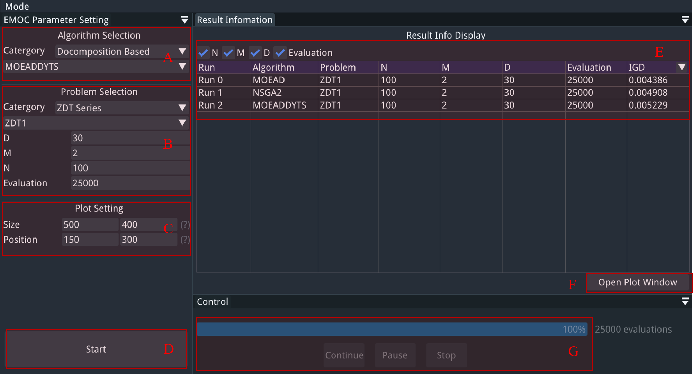
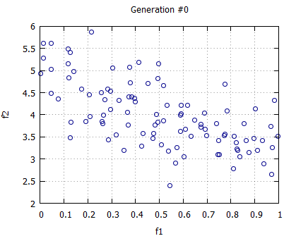
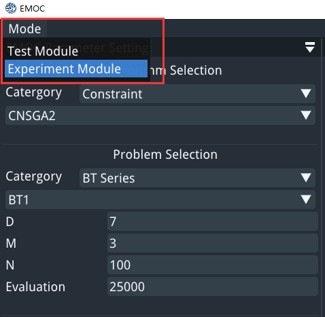
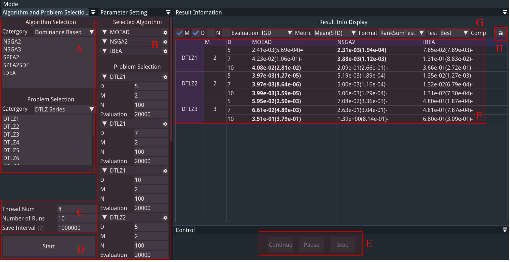

# Graphic User Interface Mode
EMOC is implemented with a user-friendly graphic user interface (GUI) which can help users get started quickly. We recommend using EMOC in GUI mode for general cases.

## Run EMOC with GUI

When EMOC has been built successfully, go to the directory of executable file and open the terminal. Enable the user interface mode with the following command:

```bash
./EMOC -g
```

For windows, change the **'./EMOC'** to **'EMOC.exe'**.

(**Note:** If you want to calculate the indicator values of optimization results, the executable file should in the same directory with **'/pf_data'**.)

## Test Module

After running EMOC in GUI mode, the default test module will be launched. This module is used to execute one algorithm on one problem each time. The optimization process will be displayed by a figure and the result will be recorded in a table.  



The interface of test module of EMOC is shown in the figure above, the functions of each regions are:

- *Region A* : Select the algorithm to be executed.
- *Region B* : Select the problem to be executed and config the parameters of this run. Note the **'D'**, **'M'**, **'N'** and **'Evaluation'** denoted for the **decision variable dimension**, **objective dimension**, **population size** and **max evaluation** respectively.
- *Region C* : Config the size and position of plotting figure.
- *Region D* : Run EMOC with the current configuration.
- *Region E* : Result history table for different runs. The last column of this table can be selected and changed to other information.
- *Region F* : Open another UI window for further analyzing the optimization results.
- *Region G* : Control the procedure of optimization (i.e.,  continue, pause and stop).

After launching the test module of EMOC, users should first config the algorithm and problem to be executed in *Region A* and *Region B*, then click the start button in *Region D*. A figure window will pop up to show the real time population of optimization:



And users can use the buttons in *Region G* to control the procedure of optimization. When the current run is finished, all the historical results can be seen in the *Region E*. 

## Experiment Module

Users can change to the experiment module by click the **'Mode'** in the menu and select the **'Experiment Module'** in the popup.



The experiment module is mainly for large scale experiment with various algorithms and problems. Multi-thread is also used to accelerating the process. The interface of this module is shown below.



The functions of each regions are:

- *Region A* : Left-click the name string to select the algorithms and problems to be executed.
- *Region B* : Config the parameters of for different algorithms and problems. The parameters meanings are same in test module.
- *Region C* : Set the parameters of this experiment, such as **'Thread Num'** (the number of thread you want to use), **'Number of Runs'** (the number of runs for each problem) and **'Save Interval'** (population saving interval in generation).
- *Region D* : Run EMOC with the current configuration.
- *Region E* : Control the procedure of this experiment (i.e.,  continue, pause and stop).
- *Region F* : Show the statistical results of current experiment.
- *Region G* : Config the types of data to be displayed in the table.
- *Region H* : Save the table in the format of Excel and LaTex.

After changing to the experiment module, users should first select the algorithms and problems to be executed in *Region A* and set their parameters in *Region B*. The configuration of this experiment can be set in *Region C*. Then click the button in *Region D* to start the experiment. The up-to-date optimization results will be displayed in the table of *Region F*. Users can change the display information and statistical test methods in *Region G*. After finishing the experiment, *Region H* provides the saving function of table. All the optimization results and saving tables will be output to the directory **'/output'**.


